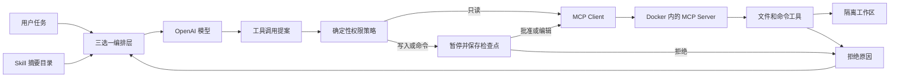

# ReAct Agent 教学板块设计

> 日期：2026-09-16  
> 状态：已通过方向评审，等待文档评审  
> 范围：只定义新增 Agent 顶层板块及首章，不包含实现

## 1. 目标

为算法手记新增独立的 **Agent** 顶层板块。首章以同一个可运行任务为基准，分别使用：

1. 纯 OpenAI Python SDK；
2. LangChain；
3. LangGraph + LangChain；

实现 ReAct（Reason → Act → Observe）Agent 循环，并统一接入：

- 文件式 `SKILL.md`；
- MCP 工具发现与调用；
- 文件读取、文件写入、命令执行工具；
- Docker 强隔离沙盒；
- Human-in-the-loop 暂停、审批与恢复。

本章首先服务于学习和记忆，其次才是代码量最少。页面需要解释每层抽象解决了什么问题，并保证三套实现比较的是编排方式，而不是三套不同的工具基础设施。

## 2. 核心设计决策

### 2.1 独立顶层板块

`Category` 从 `'algo' | 'python'` 扩展为 `'algo' | 'python' | 'agent'`。首章信息为：

- slug：`react-agent-loop`
- 编号：`A01`
- 中文名：`ReAct Agent 循环`
- 英文名：`ReAct Agent Loop`
- 路由：`/agent/react-agent-loop`

Python 板块现有 `hands-on` 继续使用 `P08`。原设计中计划放在 Python 下的 `agent-basics/P08` 不再采用。

### 2.2 共享执行内核

采用“共享执行内核 + 三种编排层”：

- 三套实现共享数据契约、Skill 加载器、MCP Server、Docker 沙盒和审批策略；
- OpenAI SDK 版手写状态机；
- LangChain 版使用高层 `create_agent` 与 middleware；
- LangGraph 版显式定义节点、边、中断与恢复。

不复制三套安全基础设施，也不在三种实现之上再封装统一 Agent Framework。前者容易漂移，后者会遮蔽原生 API，不利于学习。

### 2.3 ReAct 的可观察表达

页面使用“思考目标 → 提议 Action → 获取 Observation → 再决策”的心智模型，但不展示或伪造模型隐藏的 chain-of-thought。可视化只呈现外部可观察状态：

- 用户任务；
- 模型输出的工具调用；
- 工具参数；
- 审批状态；
- 工具结果；
- 最终回答。

## 3. 总体架构



模型调用运行在宿主进程；MCP Server 与工具运行在 Docker 容器。API Key 只提供给宿主的模型客户端，不传入工具容器。

## 4. 站点改动

### 4.1 数据与导航

- `src/data/topics.ts`
  - `Category` 增加 `agent`；
  - 新增 `agentChapters`；
  - 增加分类到路由前缀的集中映射，减少首页和侧边栏重复配置；
  - 注册 `A01` 章节及页面锚点。
- `src/pages/index.astro`
  - 新增 Agent 分类卡片区；
  - Hero 增加 Agent 统计。
- `src/components/SiteHeader.astro`
  - 新增 Agent 顶部导航入口和选中态。
- `src/components/Sidebar.astro`
  - 新增 Agent 章节组。
- `src/layouts/BaseLayout.astro`
  - `active` 支持 `agent`；
  - 更新默认标题与站点描述。

### 4.2 页面与源码展示

- `src/pages/agent/react-agent-loop.astro`
- `src/data/react-agent-loop-code.ts`
- `src/components/AgentLoopAnim.astro`
- `src/code/agent/react-agent-loop/`
- `README.md`
- `python-interview-design.md`

页面继续通过 Vite `?raw` 加载真实源码，并使用 `ghBlob` 提供 GitHub 链接。

## 5. 教学源码结构

```text
src/code/agent/react-agent-loop/
├── pyproject.toml
├── .env.example
├── common/
│   ├── contracts.py
│   ├── policy.py
│   ├── skills.py
│   ├── checkpoints.py
│   └── mcp_adapter.py
├── skills/
│   └── workspace-helper/
│       └── SKILL.md
├── sandbox/
│   └── Dockerfile
├── mcp_server.py
├── pure_openai.py
├── langchain_agent.py
├── langgraph_agent.py
├── cli.py
└── tests/
    ├── fakes.py
    ├── test_policy.py
    ├── test_sandbox.py
    ├── test_approval.py
    └── test_agent_parity.py
```

依赖版本在实现时依据当时的稳定、相互兼容版本锁定。MCP Python SDK 使用当前稳定 API；如果 v2 已稳定则使用 `MCPServer`，否则明确固定兼容版本，避免文档和代码混用不同代 API。

## 6. 公共数据契约

公共层定义以下概念，但不封装模型循环：

- `ToolProposal`
  - `call_id`
  - `tool_name`
  - `arguments`
- `ApprovalRequest`
  - 风险等级；
  - 参数规范化结果；
  - 写入预览或完整 argv；
  - 本次调用摘要哈希。
- `RunState`
  - `run_id`
  - 对话/响应状态；
  - 当前轮次与预算；
  - 待审批调用；
  - 已执行 `call_id` 集合。
- `ToolResult`
  - 成功或失败；
  - 受限后的结构化输出；
  - 是否可重试。

统一契约使三版能够产生同一种事件序列，方便测试和页面逐步对照。

## 7. Skill 设计

Skill 采用文件式 `SKILL.md`，实现 progressive disclosure：

1. 容器内的 MCP Server 启动时只扫描只读的可信 Skill 根目录；
2. 宿主通过 `list_skills` 获取名称和描述，初始上下文不包含完整正文；
3. 模型需要某项能力时调用 `read_skill`；
4. 完整 Skill 内容作为工具 Observation 返回；
5. Skill 目录只读，Agent 不能修改自身规则。

`common/skills.py` 只负责校验和规范化 MCP 返回的 Skill 元数据，不直接读取宿主文件系统，避免出现绕过 MCP 与沙盒的第二条读取路径。

首个示例 `workspace-helper/SKILL.md` 规定：

- 修改前先读取相关文件；
- 先说明计划，再产生写入提案；
- 修改后运行最小相关验证；
- 不访问工作区之外的路径；
- 不请求、打印或写入凭据。

Skill 内容、MCP schema、工具输出和用户文件全部视为不可信数据。Skill 不能提升工具权限，也不能覆盖确定性安全策略。

## 8. MCP 工具设计

MCP Server 使用本地 stdio transport，暴露：

- `list_files(path)`：只读；
- `read_file(path)`：只读；
- `write_file(path, content)`：有副作用，必须审批；
- `run_command(argv, cwd)`：有副作用，必须审批；
- `list_skills()`：只读；
- `read_skill(name)`：只读。

工具使用严格类型和 JSON Schema。MCP annotations 用于表达 `read_only`、`destructive`、`idempotent` 等意图，但只作为提示；真正的授权由 Agent 宿主侧 policy 决定。

纯 OpenAI SDK 版不会使用 OpenAI Agents SDK。它使用 Responses API，并将本地 MCP `tools/list` 结果转换为 function tools，再把 `function_call_output` 与原 `call_id` 回传模型。

原因是 OpenAI hosted MCP 面向可由 OpenAI 服务访问的 Streamable HTTP/SSE Server，不能直接连接用户本机的 Docker stdio Server。自建 adapter 可以让三版公平复用同一个本地沙盒。

## 9. Docker 沙盒

MCP Server 自身运行在容器内，而不是让宿主 MCP Server 任意执行宿主命令。

容器约束：

- 非 root 用户；
- 只读根文件系统；
- 只挂载单次运行的临时 workspace；
- Skill 目录只读；
- `--network none`；
- 限制 CPU、内存、PID、执行时间与输出大小；
- 不传入 `OPENAI_API_KEY` 或其他宿主凭据；
- 丢弃不需要的 Linux capabilities。

文件工具必须：

- 规范化路径；
- 拒绝绝对路径和 `..`；
- 验证解析后路径仍在 workspace；
- 拒绝通过软链接逃逸；
- 限制单文件读写大小。

命令工具接收 `argv: list[str]`，使用 `subprocess` 的 `shell=False`，并限制可执行程序。它不接受 shell 字符串、管道、重定向或命令拼接。Docker 是第二层隔离，不替代输入校验。

## 10. Human-in-the-loop

### 10.1 策略

- `list_files`、`read_file`、`list_skills`、`read_skill` 自动执行；
- `write_file`、`run_command` 必须暂停并审批；
- 审批不能绕过路径、命令、资源和网络策略。

### 10.2 暂停

遇到敏感调用时：

1. 规范化并验证参数；
2. 生成 `ApprovalRequest`；
3. 保存 checkpoint；
4. Agent 返回 `PendingApproval`；
5. CLI 显示 `run_id` 并退出进程。

审批界面必须显示工具名、目标、参数、风险说明以及写入预览或 argv。

### 10.3 恢复

用户可批准、拒绝；写文件允许人工编辑内容。

- 批准只适用于当前参数哈希；
- 用户在审批动作中编辑参数时，系统重新校验并计算哈希，该次动作只批准编辑后的精确参数；
- 审批完成后再次修改参数会使批准自动失效，并产生新的审批请求；
- 拒绝原因作为 Observation 返回模型，Agent 可改方案或结束；
- `call_id` 执行账本防止恢复或重试时重复副作用；
- 工具执行必须发生在批准之后。

三版使用相同 CLI 语义：

```text
python cli.py openai "完成任务"
python cli.py openai --resume RUN_ID --approve
python cli.py langchain --resume RUN_ID --reject "原因"
python cli.py langgraph --resume RUN_ID --approve
```

OpenAI SDK 版手写 checkpoint；LangChain 版使用 HITL middleware 与持久化 checkpointer；LangGraph 版使用 `interrupt()`、稳定 `thread_id` 和 `Command(resume=...)`。

LangGraph 节点恢复可能从节点开头重放，因此中断必须位于任何副作用之前；工具调用依靠 `call_id` 保持幂等。

## 11. 三种实现

### 11.1 纯 OpenAI SDK

用于看清 Agent 的本质：

1. 发送用户输入与 function tools；
2. 检查 Responses API 的输出项；
3. 无 function call 时返回最终文本；
4. 有 function call 时转换成 `ToolProposal`；
5. policy 决定自动执行或返回审批请求；
6. 将工具结果作为 `function_call_output` 回传；
7. 达到最终回答或预算上限时退出。

必须设置最大模型轮次、最大工具调用数、总超时和输出大小限制。

### 11.2 LangChain

使用高层 API 展示框架减少的样板代码：

- `create_agent`；
- MCP Adapter；
- `HumanInTheLoopMiddleware`；
- 持久化 checkpointer；
- tool/model call limit 和 tool error middleware。

页面明确指出 LangChain 的高层 Agent 运行时本身建立在 LangGraph 上，不能把这版描述成“不使用 LangGraph 的底层实现”；差异是用户是否显式建图。

### 11.3 LangGraph + LangChain

显式状态图节点：

- `call_model`
- `route_response`
- `request_approval`
- `execute_tools`
- `record_observation`
- `finish`

条件边负责区分最终回答、只读调用和敏感调用。该版本重点讲解状态、checkpoint、interrupt、resume、重放与幂等。

## 12. 页面内容

章节锚点计划为：

1. `mental-model`：ReAct 最小心智模型；
2. `state`：循环必须保存的状态与退出条件；
3. `skills`：SKILL.md 与 progressive disclosure；
4. `mcp`：工具发现、schema、调用和返回；
5. `sandbox`：Docker 信任边界；
6. `openai-sdk`：纯 SDK 手写循环；
7. `langchain`：高层 Agent 与 middleware；
8. `langgraph`：显式状态图；
9. `hitl`：暂停、审批与恢复；
10. `comparison`：三版选型、常见故障与记忆卡。

每节采用“问题 → 心智模型 → 数据流 → 关键代码 → 易错点 → 面试追问”结构。源码保留详细中文注释，但页面只重复解释关键行，避免代码注释和正文完全重复。

`AgentLoopAnim.astro` 使用现有 frame 动画模式展示：

1. 用户任务；
2. 模型提议读取 Skill；
3. 读取文件；
4. 提议写文件；
5. 循环暂停并保存 checkpoint；
6. 用户批准；
7. Docker 中执行；
8. Observation 回到模型；
9. 最终回答。

## 13. 错误处理与预算

需要区分并展示：

- 模型 API 暂时失败：有限次数指数退避；
- MCP Server 启动失败：终止并给出可操作错误；
- 工具参数错误：作为结构化 Observation 返回模型；
- 工具超时或输出过大：截断并标记；
- 用户拒绝：返回模型重新规划；
- checkpoint 缺失或参数哈希不匹配：拒绝恢复；
- 达到轮次、工具数、时间或 token 预算：安全终止；
- Docker 不可用：明确提示安装条件，不退化为宿主直接执行。

## 14. 测试与验收

### 14.1 无网络测试

使用 fake model 和 in-process/fake MCP：

- 三版产生等价事件序列；
- 最终回答路径；
- 多轮工具调用；
- 最大轮次和预算退出；
- 工具错误反馈；
- 未批准时零副作用；
- 批准后只执行一次；
- 拒绝后模型可重新规划；
- 参数变化导致旧批准失效。

### 14.2 安全测试

- `..` 和绝对路径逃逸；
- 软链接逃逸；
- 非允许 executable；
- shell 元字符不能被解释；
- 命令超时；
- 输出截断；
- 容器无网络；
- 容器非 root；
- 容器看不到宿主 API Key；
- workspace 外文件不可见。

### 14.3 站点验证

- Python 测试通过；
- Docker 集成测试通过；
- `npm run build` 通过；
- `npm run preview` 后检查导航、代码标签、动画、移动端布局；
- 浏览器控制台无错误；
- 页面上的源码链接有效。

真实 OpenAI API smoke test 为可选项，仅在用户本地显式设置 `OPENAI_API_KEY` 时运行，不能成为静态站构建的前提。

## 15. 安全规则适用说明

本章主动授予模型文件和命令能力，因此：

- 凭据只从运行环境或安全的 secret provider 读取，源码和 `.env.example` 不包含真实值；
- MCP 输入、模型输出、Skill 和工作区内容一律视为不可信；
- 宿主不执行模型拼接的 shell 字符串；
- 副作用同时受输入校验、Docker、确定性 policy、预算和人工审批约束；
- 日志不记录 API Key、认证头或完整敏感文件内容。

本设计不引入证书、自定义密码学或加密算法，因此证书有效期、密钥强度、签名算法和密码算法规则当前不适用。若以后将 MCP 改为远程服务，必须补充 TLS 1.3、服务身份认证、证书生命周期验证、请求限流和审计设计。

## 16. 非目标

首章不包含：

- React Web 审批后台；
- 多 Agent 协作；
- RAG 或向量数据库；
- 浏览器自动化；
- 远程、多租户 MCP；
- 生产级 Kubernetes/gVisor/Kata 部署；
- 自动 push 或部署。

这些能力可在后续 Agent 章节中独立设计，避免首章失去“理解一个循环”的主线。

## 17. 实施与评审边界

文档通过评审后再编写实施计划。实现完成时必须先在本地完成测试、构建和浏览器检查，然后停止并提交结果供用户评审。未得到明确批准前，不 push `main`，不触发 GitHub Pages 部署。
